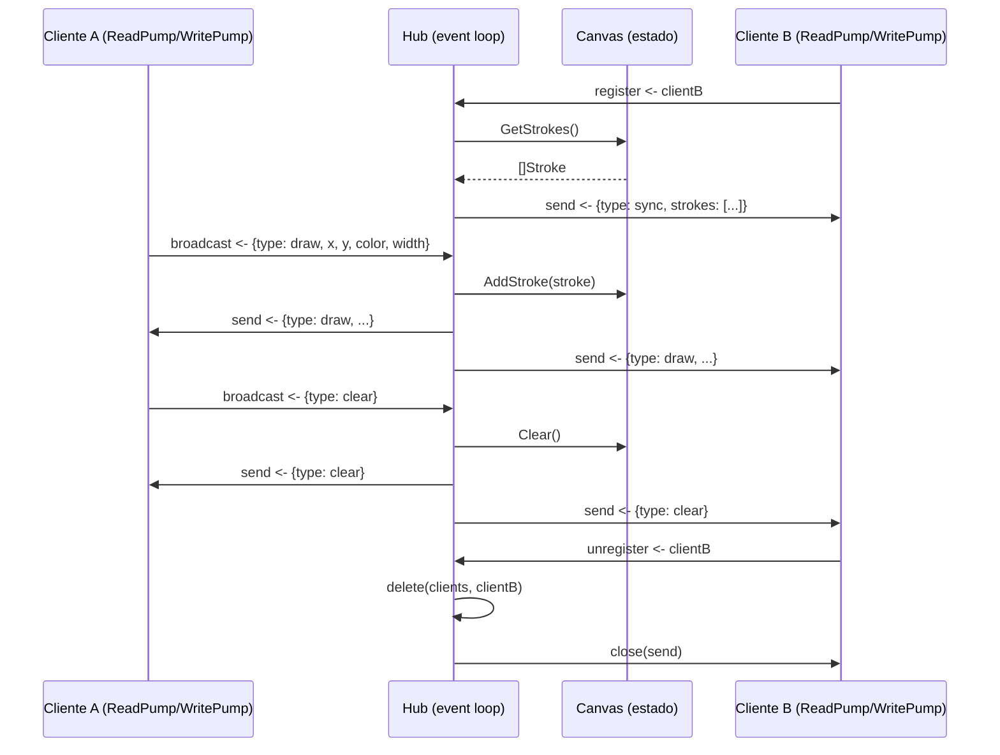

## Inkstream

  Pizarrón colaborativo en tiempo real. Varios usuarios se
  conectan y dibujan en el mismo canvas — cada trazo aparece
  instantáneamente en la pantalla de todos.

## Stack

  - Backend: Go + gorilla/websocket
  - Frontend: HTML5 Canvas + Vanilla JS
  - Estado: En memoria (sin base de datos)

## Conceptos aplicados en el backend

### WebSockets

  Conexión bidireccional persistente entre cliente y servidor. 
  A diferencia de HTTP (pedido → respuesta), WebSocket mantiene
  la conexión abierta para que el servidor pueda enviar mensajes
  en cualquier momento sin que el cliente lo pida.

### Patrón fan-out

  Cuando un usuario dibuja algo, el servidor recibe el mensaje y
  lo distribuye a todos los clientes conectados. Un mensaje
  entra, N mensajes salen.

### Goroutines y channels

  Cada usuario conectado corre dos goroutines. ReadPump lee
  mensajes del WebSocket y los manda al Hub. WritePump espera
  mensajes del Hub y los escribe al WebSocket. Las goroutines se
  comunican por channels en lugar de memoria compartida,
  evitando condiciones de carrera sin locks explícitos.

### Patrón Hub

  Una única goroutine Hub es la dueña de todo el estado
  compartido — clientes conectados y trazos del canvas. Cada
  mutación fluye por su event loop a través de channels, un
  evento a la vez, sin mutexes en el camino crítico.

### Sincronización al conectarse

  Cuando un usuario nuevo se conecta, el Hub le manda
  inmediatamente la lista completa de trazos existentes (mensaje
  sync), para que vea el estado actual del pizarrón sin que
  nadie tenga que redibujar.

### Expulsión de clientes lentos

  Si el buffer de salida de un cliente se llena, el Hub lo
  expulsa en lugar de bloquear el loop de broadcast. El cliente
  puede reconectarse y recibir un sync actualizado.

### Protocolo de mensajes
  
## Diagrama de Secuencia:

## Muestra:

## Correr localmente: 
* go run ./cmd/server/main.go

